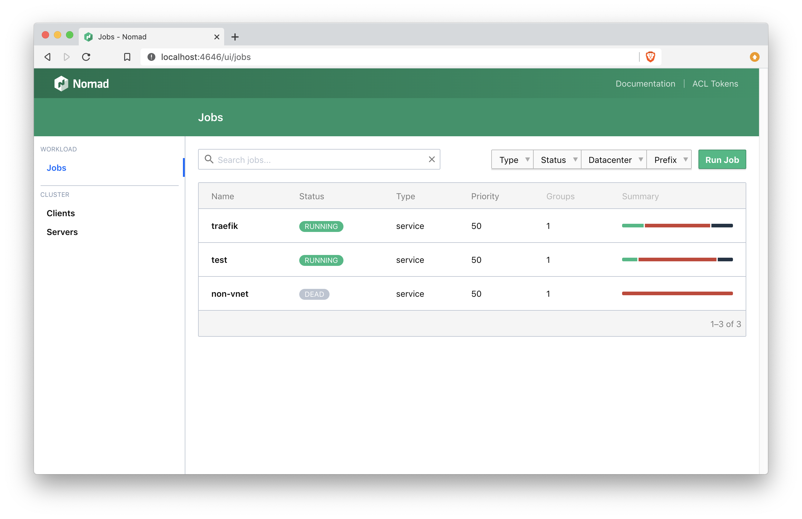

# Consul and Nomad on FreeBSD using Ansible + Terraform

This project installs a FreeBSD based Nomad cluster on Digital Ocean.

It uses Terraform to set up the infrastructure. Then finishes the server configuration
for each using Ansible.

You can first test the Ansible script locally if that's interesting. Check out the
*Using Vagrant & Virtualbox* section for more info.

## Installing local dependencies

Your machine does need some local dependencies. Primarily `ansible`. To install run this command:

```
pip3 install ansible
```

This will install the `ansible` suit of tools.

## Where Configurations and Preserved Files Live

On FreeBSD configuration files live in the `/etc/<package name>/` directory.
For preserving state, `/var/<package name>` can be used

For example, the configurations for `consul` are located in `/etc/consul/`.
Either `/etc/consul/consul.hcl` and/or `/etc/consul/server.hcl` will be there.
The startup script is located in `/etc/rc.d/`
The working directory is `/var/consul/`

## Setting up Consul for the first time

According to the [documentation](https://www.consul.io/docs/agent/options.html#_encrypt) the `-encrypt` option
should be used. Additionally, you should only have to use it once.

Instead of committing this key to the repository, it can be kept on the configuring machine
as an environment variable. Then using `consul keyring -install=<key>` you can install the key.

## Using Vagrant & Virtualbox

First you can always use Vagrant and Virtualbox to test the setup.
Make sure you have [Vagrant](https://www.vagrantup.com/downloads.html) and [Virtualbox 6.0]([#](https://www.virtualbox.org/wiki/Download_Old_Builds_6_0)) setup beforehand. (Virtualbox 6.1 is yet to be supported.)

Then run

```
vagrant up
```

This will download and provision your image. To connect
use:

```
vagrant ssh
```

## Running servers to test

The configuration files are from [here](https://learn.hashicorp.com/nomad/getting-started/cluster). Not necessarily for production but good for testing.

Start the `consul` server. (For development only)

```
consul agent -dev
```

Start the `nomad` server. (For development only)

```
nomad agent -config config/server.hcl &
```

Start the `nomad` client. (For development only)

```
nomad agent -config config/client.hcl &
```

## Extras

Here's some extra stuff to learn about when navigating FreeBSD.

### Checking memory usage

FreeBSD commands are slightly different than ones on Linux.
To check a friendly view of memory usage, use `freecolor`

```
freecolor
```

Here's the response from a freshly running system:

```
$ freecolor
Physical  : [##########################.........] 75%   (738324/977976)
Swap      : [###################################] 100%  (2097152/2097152)
```

```
$ freecolor -m -o
             total       used       free     shared    buffers     cached
Mem:           955        234        721          0          0          0
Swap:         2048          0       2048
```

### **Who**'s logged in?

Running the `who` command will tell you which user is logged in

```
$ who
vagrant          pts/0        Jan 18 17:39 (10.0.2.2)
```

### Stopping or starting services

Running the `sudo service <service name> <action>` command will get you there

Here are some examples:

```
sudo service mysql-server start
```

```
sudo service mysql-server status
```

```
sudo service mysql-server stop
```

You can also run the `rc.d` script:

```
sudo /etc/rc.d/mysql-server status
```

The `service` command makes it simpler to handle these things

### Enabling services

Example:

```
sudo sysrc mysql_enable=yes
```

You can also edit the `/etc/rc.conf` file.

### Running Consul and Nomad in the background

After much head-scratching, I noticed that some of the files in `/etc/rc.d/` used `daemon`. Turns out `daemon` is a great way to execute your
programs and place them in the background!

If you are running multiple `daemon` instances you need to do one thing further. You need to define `pidFile` **AND** `procname`. Otherwise
freeBSD will think your multiple daemon'd processes are one in the same.

### Creating jails requires iocage manager

```
sudo pkg install --yes py37-iocage
```

This will install. Then download the jail image:

```
sudo iocage fetch -r 12.1-RELEASE
```

Or use the `LATEST` option

```
iocage fetch -r LATEST
```

That will download the latest release.

You can also use a more interactive form:

```
sudo iocage fetch
```

Here's an example output:

```
$ sudo iocage fetch
Setting up zpool [zroot] for iocage usage
If you wish to change please use "iocage activate"
********************************************************************************
fdescfs(5) is not mounted, performance may suffer. Please run:
mount -t fdescfs null /dev/fd
You can also permanently mount it in /etc/fstab with the following entry:
fdescfs /dev/fd  fdescfs  rw  0  0
********************************************************************************

Creating zroot/iocage
Creating zroot/iocage/download
Creating zroot/iocage/images
Creating zroot/iocage/jails
Creating zroot/iocage/log
Creating zroot/iocage/releases
Creating zroot/iocage/templates
Default configuration missing, creating one
[0] 11.2-RELEASE (EOL)
[1] 11.3-RELEASE
[2] 12.0-RELEASE
[3] 12.1-RELEASE

Type the number of the desired RELEASE
Press [Enter] to fetch the default selection: (12.1-RELEASE)
Type EXIT to quit:
Fetching: 12.1-RELEASE

Downloading: MANIFEST [####################] 100%
Downloading: base.txz [####################] 100%
Downloading: lib32.txz [####################] 100%
Downloading: src.txz [####################] 100%
Extracting: base.txz...
Extracting: lib32.txz...
Extracting: src.txz...
```

### Creating a jail

Once you're set up you can install a jail:

```
sudo iocage create -r LATEST -n traefik
```

An example of this is here:

```
$ sudo iocage create -r LATEST -n traefik
********************************************************************************
fdescfs(5) is not mounted, performance may suffer. Please run:
mount -t fdescfs null /dev/fd
You can also permanently mount it in /etc/fstab with the following entry:
fdescfs /dev/fd  fdescfs  rw  0  0
********************************************************************************

Missing default rc.conf, creating it
traefik successfully created!
```

The mount point for this jail is: `/zroot/iocage/jails/traefik/root`

We now can run a test job to see if it takes!

### Running the job

Nomad uses the concept of a *job* for running tasks across a cluster. Here's how you can do it.

First, copy the `nomad` folder to the FreeBSD server in question.
Then run `nomad job plan nomad/traefik.hcl`

An example output is something like this:

```
$ nomad job plan traefik.nomad
Job: "traefik"
Task Group: "traefik" (1 ignore)
  Task: "test01"

Scheduler dry-run:
- All tasks successfully allocated.

Job Modify Index: 419
To submit the job with version verification run:

nomad job run -check-index 419 traefik.nomad

When running the job with the check-index flag, the job will only be run if the
server side version matches the job modify index returned. If the index has
changed, another user has modified the job and the plan's results are
potentially invalid.
```

This will set up your job to be deployed on your cluster.
Then, you can run `nomad job run -check-index 419 traefik.nomad`. Your `check-index` may be different so check the output of your `nomad job plan`.

You can then check the status using `nomad job status`. Example:

```
$ nomad job status
ID        Type     Priority  Status   Submit Date
non-vnet  service  50        dead     2020-01-19T04:06:01Z
test      service  50        running  2020-01-19T04:33:18Z
traefik   service  50        running  2020-01-19T04:40:03Z
```

Conveniently, some important ports are forwarded in the `Vagrantfile` including 4646. This is the UI for Nomad. So simply go to your web broswer and put in: `http://localhost:4646`. Your web console should show up. You can check status and even resource utilization all in the same place!



## Resources

There are a ton of resources out there. Unfortunately I had to cobble many together to get even this far in this project. Hashicorp's tutorials and guides have been great. Particularly the ones on Nomad. They get you up and runing lightening speed compared to my learning process here.

* [Learn Nomad @ Hashicorp](https://learn.hashicorp.com/nomad)
* [Learn Consul @ Hashicorp](https://learn.hashicorp.com/consul)
* [Consul Configuration info](https://www.consul.io/docs/agent/options.html)
* [Nomad Configuration info](https://www.nomadproject.io/docs/configuration/index.html)
* [iocage for Configuring Jails](https://github.com/fractalcells/ansible-iocage)
* [Configure Jail on Digital Ocean droplet](https://www.kirkg.us/posts/how-to-configure-a-freebsd-jail-on-a-digital-ocean-droplet/)
* [Nomad FreeBSD Jail driver](https://github.com/cneira/jail-task-driver#installation)

## Other Interesting Finds

Here are some other interesting finds while playing around on this project:

* [Bastille](https://github.com/BastilleBSD/bastille) aims to make building jails easier.
